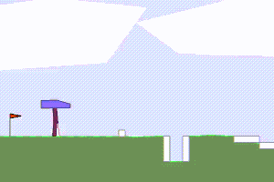

[](https://travis-ci.com/araffin/rl-baselines-zoo)

# RL Baselines Zoo: a Collection of Pre-Trained Reinforcement Learning Agents



A collection of trained Reinforcement Learning (RL) agents, with tuned hyperparameters, using [Stable Baselines](https://github.com/hill-a/stable-baselines).

We are **looking for contributors** to complete the collection!

Goals of this repository:

1. Provide a simple interface to train and enjoy RL agents
2. Benchmark the different Reinforcement Learning algorithms
3. Provide tuned hyperparameters for each environment and RL algorithm
4. Have fun with the trained agents!

## Enjoy a Trained Agent


If the trained agent exists, then you can see it in action using:
```
python enjoy.py --algo algo_name --env env_id
```

For example, enjoy A2C on Breakout during 5000 timesteps:
```
python enjoy.py --algo a2c --env BreakoutNoFrameskip-v4 --folder trained_agents/ -n 5000
```

## Train an Agent

The hyperparameters for each environment are defined in `hyperparameters/algo_name.yml`.

If the environment exists in this file, then you can train an agent using:
```
python train.py --algo algo_name --env env_id
```

For example (with tensorboard support):
```
python train.py --algo ppo2 --env CartPole-v1 --tensorboard-log /tmp/stable-baselines/
```

Train for multiple environments (with one call) and with tensorboard logging:
```
python train.py --algo a2c --env MountainCar-v0 CartPole-v1 --tensorboard-log /tmp/stable-baselines/
```

Continue training (here, load pretrained agent for Breakout and continue training for 5000 steps):
```
python train.py --algo a2c --env BreakoutNoFrameskip-v4 -i trained_agents/a2c/BreakoutNoFrameskip-v4.pkl -n 5000
```

Note: when training TRPO, you have to use `mpirun` to enable multiprocessing:

```
mpirun -n 16 python train.py --algo trpo --env BreakoutNoFrameskip-v4
```

## Hyperparameter Tuning

We use [Optuna](https://optuna.org/) for optimizing the hyperparameters.

Note: hyperparameters search is not implemented for ACER and DQN for now.
when using SuccessiveHalvingPruner ("halving"), you must specify `--n-jobs > 1`

Budget of 1000 trials with a maximum of 50000 steps:

```
python train.py --algo ppo2 --env MountainCar-v0 -n 50000 -optimize --n-trials 1000 --n-jobs 2 \
  --sampler tpe --pruner median
```


## Record a Video of a Trained Agent

Record 1000 steps:

```
python -m utils.record_video --algo ppo2 --env BipedalWalkerHardcore-v2 -n 1000
```


## Current Collection: 120+ Trained Agents!

Scores can be found in `benchmark.md`. To compute them, simply run `python -m utils.benchmark`.

### Atari Games

7 atari games from OpenAI benchmark (NoFrameskip-v4 versions).

|  RL Algo |  BeamRider         | Breakout           | Enduro             |  Pong | Qbert | Seaquest           | SpaceInvaders      |
|----------|--------------------|--------------------|--------------------|-------|-------|--------------------|--------------------|
| A2C      | :heavy_check_mark: | :heavy_check_mark: | :heavy_check_mark: | :heavy_check_mark: | :heavy_check_mark: | :heavy_check_mark:| :heavy_check_mark:|
| ACER     | :heavy_check_mark: |                    | :heavy_check_mark: | :heavy_check_mark: | :heavy_check_mark: | :heavy_check_mark:| :heavy_check_mark: |
| ACKTR    | :heavy_check_mark: | :heavy_check_mark:| :heavy_check_mark: | :heavy_check_mark:| :heavy_check_mark:| :heavy_check_mark:|  :heavy_check_mark: |
| PPO2     | :heavy_check_mark: | :heavy_check_mark:| :heavy_check_mark: | :heavy_check_mark: | :heavy_check_mark: | :heavy_check_mark:|  :heavy_check_mark: |
| DQN     | :heavy_check_mark: | :heavy_check_mark: | :heavy_check_mark: | :heavy_check_mark:| :heavy_check_mark: | :heavy_check_mark:| :heavy_check_mark: |
| TRPO     | | | | | | | |


Additional Atari Games (to be completed):

|  RL Algo |  MsPacman   |
|----------|-------------|
| A2C      | :heavy_check_mark: |
| ACER     | :heavy_check_mark: |
| ACKTR    | :heavy_check_mark: |
| PPO2     | :heavy_check_mark: |
| DQN      | :heavy_check_mark: |

### Classic Control Environments

|  RL Algo |  CartPole-v1 | MountainCar-v0 | Acrobot-v1 |  Pendulum-v0 | MountainCarContinuous-v0 |
|----------|--------------|----------------|------------|--------------|--------------------------|
| A2C      | :heavy_check_mark: | :heavy_check_mark: | :heavy_check_mark: | :heavy_check_mark: | :heavy_check_mark: |
| ACER     | :heavy_check_mark: | :heavy_check_mark: | :heavy_check_mark: | N/A | N/A |
| ACKTR    | :heavy_check_mark: | :heavy_check_mark: | :heavy_check_mark: | :heavy_check_mark: | :heavy_check_mark: |
| PPO2     | :heavy_check_mark: | :heavy_check_mark: | :heavy_check_mark: | :heavy_check_mark: | :heavy_check_mark: |
| DQN      | :heavy_check_mark: | :heavy_check_mark: | :heavy_check_mark: | N/A | N/A |
| DDPG     |  N/A |  N/A  | N/A | :heavy_check_mark: | :heavy_check_mark: |
| SAC      |  N/A |  N/A  | N/A | :heavy_check_mark: | :heavy_check_mark: |
| TD3      |  N/A |  N/A  | N/A | :heavy_check_mark: | :heavy_check_mark: |
| TRPO     | :heavy_check_mark: | :heavy_check_mark: | | :heavy_check_mark: | :heavy_check_mark: |


### Box2D Environments

|  RL Algo |  BipedalWalker-v2 | LunarLander-v2 | LunarLanderContinuous-v2 |  BipedalWalkerHardcore-v2 | CarRacing-v0 |
|----------|--------------|----------------|------------|--------------|--------------------------|
| A2C      | :heavy_check_mark: | :heavy_check_mark: | :heavy_check_mark: | :heavy_check_mark: | |
| ACER     | N/A | :heavy_check_mark: | N/A | N/A | N/A |
| ACKTR    | :heavy_check_mark: | :heavy_check_mark: | :heavy_check_mark: | :heavy_check_mark: | |
| PPO2     | :heavy_check_mark: | :heavy_check_mark: | :heavy_check_mark: | :heavy_check_mark: | |
| DQN      | N/A | :heavy_check_mark: | N/A | N/A | N/A |
| DDPG     | :heavy_check_mark: | N/A | :heavy_check_mark: | | |
| SAC      | :heavy_check_mark: | N/A | :heavy_check_mark: | :heavy_check_mark: | |
| TD3      | :heavy_check_mark: | N/A | :heavy_check_mark: | | |
| TRPO     | :heavy_check_mark: | :heavy_check_mark: | :heavy_check_mark: | | |

### PyBullet Environments

See https://github.com/bulletphysics/bullet3/tree/master/examples/pybullet/gym/pybullet_envs.
Similar to [MuJoCo Envs](https://gym.openai.com/envs/#mujoco) but with a free simulator: pybullet. We are using `BulletEnv-v0` version.

Note: those environments are derived from [Roboschool](https://github.com/openai/roboschool) and are much harder than the Mujoco version (see [Pybullet issue](https://github.com/bulletphysics/bullet3/issues/1718#issuecomment-393198883))

|  RL Algo |  Walker2D | HalfCheetah | Ant | Reacher |  Hopper | Humanoid |
|----------|-----------|-------------|-----|---------|---------|----------|
| A2C      | :heavy_check_mark: | :heavy_check_mark: | :heavy_check_mark: | | :heavy_check_mark: | |
| ACKTR    | | :heavy_check_mark: | | | | |
| PPO2     | :heavy_check_mark: | :heavy_check_mark: | :heavy_check_mark: | :heavy_check_mark: | :heavy_check_mark: | :heavy_check_mark: |
| DDPG     | :heavy_check_mark: | :heavy_check_mark: | :heavy_check_mark: | | | |
| SAC      | :heavy_check_mark: | :heavy_check_mark: | :heavy_check_mark: | :heavy_check_mark: | :heavy_check_mark: | :heavy_check_mark: |
| TD3      | :heavy_check_mark: | :heavy_check_mark: | :heavy_check_mark: | | :heavy_check_mark: | :heavy_check_mark: |
| TRPO     | :heavy_check_mark: | :heavy_check_mark: | :heavy_check_mark: | | :heavy_check_mark: | |

PyBullet Envs (Continued)

|  RL Algo |  Minitaur | MinitaurDuck | InvertedDoublePendulum | InvertedPendulumSwingup |
|----------|-----------|-------------|-----|---------|
| A2C      | | | | |
| ACKTR    | | | | |
| PPO2     | :heavy_check_mark: | :heavy_check_mark: | :heavy_check_mark: | :heavy_check_mark: |
| DDPG     | | | | |
| SAC      | | | :heavy_check_mark: | :heavy_check_mark: |
| TD3      | | | :heavy_check_mark: | :heavy_check_mark: |
| TRPO     | | | |  |

### MiniGrid Envs

See https://github.com/maximecb/gym-minigrid
A simple, lightweight and fast Gym environments implementation of the famous gridworld.

|  RL Algo | Empty | FourRooms | DoorKey | MultiRoom | Fetch |
|----------|-------|-----------|---------|-----------|-------|
| A2C      | | | | | |
| PPO2     | | :heavy_check_mark: | :heavy_check_mark: | | |
| DDPG     | | | | | |
| SAC      | | | | | |
| TRPO     | | | | | |

There are 19 environment groups (variations for each) in total.

Note that you need to specify --gym-packages gym_minigrid with enjoy.py and train.py as it is not a standard Gym environment, as well as installing the custom Gym package module or putting it in python path.

```
pip install gym-minigrid
python train.py --algo ppo2 --env MiniGrid-DoorKey-5x5-v0 --gym-packages gym_minigrid
```

This does the same thing as:

```python
import gym_minigrid
```

Also, you may need to specify a Gym environment wrapper in hyperparameters, as MiniGrid environments have Dict observation space, which is not supported by StableBaselines for now.

```
MiniGrid-DoorKey-5x5-v0:
  env_wrapper: gym_minigrid.wrappers.FlatObsWrapper
```

## Colab Notebook: Try it Online!

You can train agents online using [colab notebook](https://colab.research.google.com/drive/1cPGK3XrCqEs3QLqiijsfib9OFht3kObX).

## Installation

### Stable-Baselines PyPi Package

Min version: stable-baselines[mpi] >= 2.8.0

```
apt-get install swig cmake libopenmpi-dev zlib1g-dev ffmpeg
pip install stable-baselines[mpi] box2d box2d-kengz pyyaml pybullet optuna pytablewriter scikit-optimize
```

Please see [Stable Baselines README](https://github.com/hill-a/stable-baselines) for alternatives.

### Docker Images

Build docker image (CPU):
```
docker build . -f docker/Dockerfile.cpu -t rl-baselines-zoo-cpu
```

GPU:
```
docker build . -f docker/Dockerfile.gpu -t rl-baselines-zoo
```

Pull built docker image (CPU):
```
docker pull araffin/rl-baselines-zoo-cpu
```

GPU image:
```
docker pull araffin/rl-baselines-zoo
```

Run script in the docker image:

```
./run_docker_cpu.sh python train.py --algo ppo2 --env CartPole-v1
```

## Tests

To run tests, first install pytest, then:
```
python -m pytest -v tests/
```

## Contributing

If you trained an agent that is not present in the rl zoo, please submit a Pull Request (containing the hyperparameters and the score too).

## Contributors

We would like to thanks our contributors: [@iandanforth](https://github.com/iandanforth), [@tatsubori](https://github.com/tatsubori)
